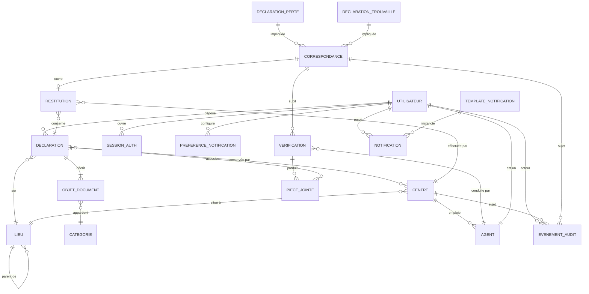
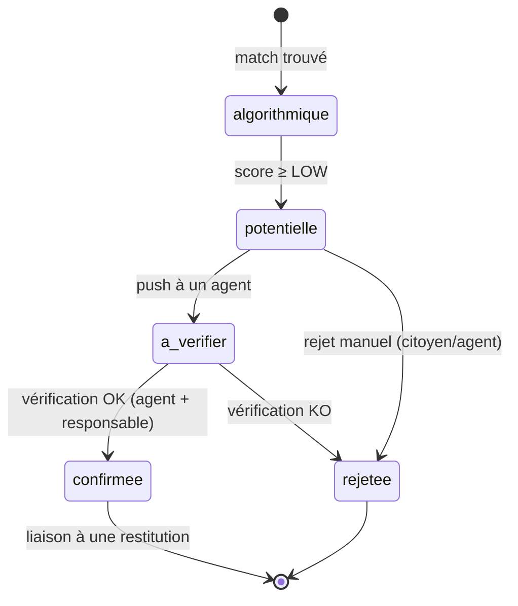

# MALI RETROUVÉ — Analyse d'architecture logicielle

**Auteur du livrable :** Spécialiste architecture logicielle (Kilo)
**Date :** 2026-09-02
**Périmètre :** Cadrage conceptuel, modèle fonctionnel, modèle de données, système de rapprochement, notifications, centres partenaires, administration, architecture technique recommandée.
**Statut :** DÉDUCTION + RECOMMANDATION à arbitrer avec les autres spécialistes (sécurité, données, UX, juridique).

---

## 0. Conventions de lecture

Chaque affirmation est étiquetée :

- **FAIT** — élément observé dans l'énoncé, le contexte opérationnel malien ou des standards publics non contestés.
- **SOURCE** — référence normative ou documentaire (loi, APDP, OWASP, ISO, etc.).
- **DÉDUCTION** — conclusion logique dérivée des faits par l'auteur.
- **RECOMMANDATION** — proposition jugée la plus pragmatique par l'auteur, à arbitrer.
- **HYPOTHÈSE** — supposition à confirmer (volumétrie, équipement des centres, connectivité, etc.).
- **DÉCISION À PRENDRE** — choix business/technique exigeant un arbitrage explicite.
- **POINT À VÉRIFIER** — élément à confirmer avec une source externe avant implémentation.

Aucune ligne de code, aucun schéma SQL DDL, aucun script de déploiement n'est livré ici. Le présent document est un **modèle conceptuel d'architecture** (vue logique + orientations techniques).

---

## 10. Architecture fonctionnelle

### 10.1 Vision synthétique

**FAIT.** La plateforme nationale « Mali Retrouvé » agrège trois sous-systèmes métier :

1. **Sous-système Déclarations** (perte / trouvaille) tenu par les citoyens, les agents de centre et les forces de l'ordre (HYPOTHÈSE — à confirmer pour la gendarmerie/police).
2. **Sous-système Rapprochement** qui transforme deux flux (perte ↔ trouvaille) en correspondances qualifiées.
3. **Sous-système Centres partenaires** qui prennent en charge physiquement les objets/documents trouvés, valident, conservent, restituent.

**DÉDUCTION.** Trois domaines transverses complètent le tout : **Identité & Accès**, **Notifications**, **Audit & Conformité**. Aucun flux de valeur ne doit pouvoir court-circuiter ces trois domaines (principe d'observabilité totale, voir §10.10).

### 10.2 Domaines métier (DDD lite)

| Domaine (bounded context) | Responsabilité unique | Agrégat racine |
|---|---|---|
| **Déclaration** | Enregistrer et qualifier une perte ou une trouvaille | `Déclaration` |
| **Correspondance** | Apparier, scorer, faire évoluer l'état d'un rapprochement | `Correspondance` |
| **Centre** | Gérer les sites physiques, agents, capacités, horaires | `Centre` |
| **Restauration** | Pipeline physique de restitution (réception → vérification → restitution) | `Dossier de restitution` |
| **Identité** | Comptes citoyens/agents, authentification, MFA, sessions | `Compte` |
| **Notification** | Émettre, router, throttler, tracer les communications sortantes | `Notification` |
| **Audit** | Journal d'événements immuable, piste de contrôle, reporting APDP | `Événement d'audit` |
| **Administration** | Indicateurs, drill-down géographique, supervision, configuration | `VueAgrégée` (read-model) |
| **Catalogue** | Référentiels (catégories, lieux administratifs, types de documents) | `Référentiel` |
| **Stockage** | Métadonnées d'objets/documents scannés, photos, preuves | `PièceJointe` |

**RECOMMANDATION.** Cette séparation suit le découpage en modules du code (monorepo, voir §11) et évite les domaines « fourre-tout » type `gestion` ou `admin` qui concentrent la dette technique.

### 10.3 Relations entre domaines

```
                 ┌────────────────────┐
                 │ Catalogue (référ.) │  (lu par tous)
                 └──────────┬─────────┘
                            │
        ┌───────────────────┼───────────────────┐
        ▼                   ▼                   ▼
  Déclaration         Centre              Identité
        │                │                    │
        │  crée          │  possède           │  publie compte
        ▼                ▼                    ▼
   Correspondance  Restauration ◄──────► Audit
        │                │                    ▲
        │ déclenche      │                    │
        ▼                ▼                    │
     Notification ─────────────────────────────┘
```

**DÉDUCTION.** Le domaine `Audit` est **abonné** à tous les autres (pattern observer interne). Aucune opération sensible ne peut avoir lieu sans un événement publié. C'est un pilier de conformité APDP (voir §16.8).

### 10.4 Modules applicatifs (frontière technique)

**RECOMMANDATION.** Chaque bounded context devient un module applicatif indépendant, partageant des contrats stables (DTO, événements domaine, enums d'état). Déploiement possible en monolithe modulaire au début (volumétrie nationale modérée), extraction ultérieure en microservices si un module sature (Notification, Correspondance).

| Module | API publique (vue) | Événements émis | Événements consommés |
|---|---|---|---|
| `declaration-svc` | REST `/v1/declarations` | `DeclarationCreated`, `DeclarationUpdated` | — |
| `matching-svc` | REST `/v1/correspondances`, async worker | `MatchCandidateFound`, `MatchScoreChanged`, `MatchStateChanged` | `DeclarationCreated` |
| `center-svc` | REST `/v1/centres`, `/v1/agents` | `CentreCreated`, `CentreValidated`, `CentreClosed`, `AgentAssigned` | — |
| `restitution-svc` | REST `/v1/restitutions` | `RestitutionInitiated`, `RestitutionVerified`, `RestitutionCompleted`, `RestitutionRejected` | `MatchStateChanged` |
| `identity-svc` | REST `/v1/auth/*`, `/v1/comptes/*` | `AccountCreated`, `LoginSucceeded`, `LoginFailed`, `MFAEnabled` | — |
| `notification-svc` | REST `/v1/notifications`, `/v1/preferences` | `NotificationDispatched`, `NotificationFailed`, `NotificationRead` | (tous événements métier) |
| `audit-svc` | Write-only ingest + REST lecture | — | (tous événements) |
| `catalog-svc` | REST `/v1/referentiels/*` | `ReferentielUpdated` | — |
| `storage-svc` | REST `/v1/pieces` (métadonnées) + upload signé | `PieceUploaded`, `PieceArchived`, `PiecePurged` | `RestitutionCompleted` (purge) |

### 10.5 APIs externes consommées

**DÉCISION À PRENDRE.** Liste à arbitrer avec les parties prenantes :

- **HYPOTHÈSE.** SMS Gateway (opérateur malien — Orange Mali, Malitel) — à confirmer.
- **HYPOTHÈSE.** WhatsApp Business API (partenaire Meta officiel ou BSP local).
- **HYPOTHÈSE.** Service mail transactionnel (à choisir selon localisation des données).
- **HYPOTHÈSE.** Service de vérification d'identité (optionnel) : comparaison faciale photo/vidéo, OCR CNI. À traiter dans un module séparé `kyc-svc` si retenu (volumétrie, coût, acceptabilité APDP).
- **SOURCE.** Pour les paiements éventuels de frais de restitution : opérateurs Mobile Money (Orange Money, Moov Money) — adapté au contexte.

### 10.6 Moteur de rapprochement — interface conceptuelle

Le moteur de rapprochement (voir §13) est exposé via :

- `POST /v1/correspondances/recompute` — recalcul à la demande (admin).
- `GET /v1/correspondances?declarationId=&state=&minScore=` — listing filtrable.
- `POST /v1/correspondances/{id}/transition` — transition d'état (à vérifier → confirmée, etc.) avec justification obligatoire.
- Webhook interne (`async`) : `MatchCandidateFound` consommé par `notification-svc` et `audit-svc`.

**RECOMMANDATION.** L'API de transition d'état suit un FSM strict (Finite State Machine, voir §13.6). Aucune mutation directe d'état par les clients ; seul le endpoint de transition est autorisé.

### 10.7 Système de notification

Voir §14 (architecture détaillée). Sur le plan fonctionnel, le module `notification-svc` :

- Reçoit des événements internes (toutes provenances).
- Applique les préférences utilisateurs et les règles anti-spam.
- Sélectionne le canal optimal (SMS prioritaire pour OTP, WhatsApp/email selon contexte).
- Trace l'envoi, le statut de livraison, l'éventuelle lecture.
- Expose une API REST pour les préférences et l'historique, plus une API in-app (polling long ou SSE ; WebSocket à évaluer).

### 10.8 Authn / Authz (résumé fonctionnel, voir §17 et §18)

- **Citoyen** : inscription par téléphone (OTP SMS) + email optionnel, MFA recommandé sur email si activé.
- **Agent de centre** : compte créé par un responsable de centre, MFA obligatoire (TOTP, OTP SMS en backup).
- **Responsable de centre / Superviseur régional / Administrateur national / Auditeur / Administrateur technique** : MFA obligatoire (TOTP), session courte, journal d'accès privilégié.
- **Authz** : RBAC (Role-Based Access Control) + ABAC léger (resource ownership, scope géographique).

### 10.9 Audit log

- **FAIT.** La Loi 2013-015 et l'APDP exigent une traçabilité des traitements de données personnelles.
- **RECOMMANDATION.** `audit-svc` écrit en **append-only** (insertion uniquement, pas d'update ni de delete côté API). Conservation 24 mois (RECOMMANDATION — vérifier obligation APDP exacte), rétention configurable, export possible sur demande DPO.
- Champs minimum : `who` (compte/rôle), `what` (action), `when` (UTC + offset local), `where` (IP, géolocalisation approximative), `on_what` (ressource, type, identifiant), `why` (raison métier ou numéro de dossier), `outcome` (succès/échec), `correlation_id`.
- **DÉCISION À PRENDRE.** Choisir entre base append-only dédiée (WORM) ou table SQL standard avec contraintes d'intégrité. La première est plus solide ; la seconde est plus simple.

### 10.10 Stockage documents/photos

- **Métadonnées** dans `storage-svc` (table relationnelle) : identifiant opaque, hash SHA-256 du contenu, taille, type MIME, déclaration/centre associés, date d'upload, date de péremption (rétention), statut juridique.
- **Blob** stocké hors base (object storage chiffré, voir §11).
- **Accès** par URL pré-signée à durée courte (≤ 5 min) ou par proxy authentifié.
- **Chiffrement** côté serveur (chiffrement au repos) + TLS en transit.
- **Rétention** différenciée :
  - Photos de CNI / passeports : tant que la déclaration est active + 12 mois (cohérent avec la rétention actuelle du site existant).
  - Photos d'objets : 12 mois après clôture du dossier.
  - Photos après restitution réussie : purge automatique (ou conservation anonymisée selon politique APDP — POINT À VÉRIFIER).

### 10.11 Administration

Voir §16 pour la définition complète. Sur le plan fonctionnel, le module `admin-svc` (ou `reporting-svc`) agrège des **vues matérialisées** (read-models) à partir des événements émis par les autres modules. Aucun calcul lourd dans le flux transactionnel.

### 10.12 Statistiques

- **Read-models** séparés du transactionnel (CQRS léger).
- Rafraîchissement asynchrone (job planifié) ou event-driven.
- Indicateurs minimum (voir §16.4).
- **API** : `GET /v1/stats/{niveau}` avec paramètres `level=region|cercle|commune|centre`, `from`, `to`, `indicators[]`.

### 10.13 Frontières et responsabilités (résumé)

| Frontière | Responsabilité exclusive | Anti-pattern à éviter |
|---|---|---|
| `declaration-svc` | Cycle de vie d'une déclaration | Ne connaît ni les centres ni les correspondances (sauf via événements) |
| `matching-svc` | Calcul de score, transitions d'état de correspondance | Ne modifie pas les déclarations |
| `restitution-svc` | Pipeline physique | Ne fait pas le matching |
| `center-svc` | Centres, agents, capacités | Ne gère pas les objets trouvés directement (c'est `restitution-svc`) |
| `notification-svc` | Émission de messages | Ne contient pas la logique métier qui décide *quand* notifier |
| `identity-svc` | Authn, comptes, sessions | Ne stocke pas les déclarations |
| `audit-svc` | Journalisation | Aucune logique métier, aucune consultation métier |
| `catalog-svc` | Référentiels | Lecture seule pour les autres modules |

**DÉDUCTION.** Cette grille empêche un module d'écrire dans l'agrégat d'un autre (par exemple un match qui modifierait une déclaration). Toute modification transverse passe par API + événement.

---

## 11. Architecture technique recommandée

### 11.1 Trois options envisagées

| Critère | Option A — On-Premise national | Option B — Cloud public international | Option C — Cloud souverain / local hybride |
|---|---|---|---|
| Hébergement | Datacenter national Mali (ou régional CEDEAO) | AWS / Azure / GCP région Europe/Afrique du Sud | Cloud local africain + relais cloud souverain hors UE |
| Souveraineté données | Très forte (DÉDUCTION) | Faible — données quittent le pays (POINT À VÉRIFIER selon APDP) | Forte si cloud local certifié |
| Sécurité | À construire (WAF, IDS/IPS, SOC) | Très mature, certifications multiples | Variable selon fournisseur |
| Coût initial | Élevé (CAPEX matériel) | Faible | Modéré |
| Coût récurrent | Modéré | Élevé à l'échelle nationale | Modéré à élevé |
| Scalabilité | Limitée par capacité DC | Élastique | Élargie mais avec paliers |
| Compétences requises au Mali | Systèmes, réseau, DBA | DevOps cloud | Mixte |
| Performance pour 100k+ déclarations/an | Suffisant | Très bon | Suffisant |
| Sauvegarde / PRA | À construire (DC secondaire, bandes) | Natif multi-AZ/région | Hybride |
| Observabilité | À construire (Prometheus/Grafana/ELK) | Natif (CloudWatch, etc.) | À construire |
| Échelle nationale (20 régions × cercles × communes × villages) | Adapté avec maillage | Adapté mais avec latence WAN | Adapté |
| Local hosting (option politique) | Excellent | Faible | Bon |
| Indépendance vis-à-vis fournisseurs | Forte | Faible (lock-in) | Moyenne |

**FAIT.** Le contexte est national, sensible, soumis à l'APDP.
**HYPOTHÈSE.** Volumétrie estimée à 100k–500k déclarations/an (DÉDUCTION — à calibrer par une étude d'usage ; pour les CNI seules le site existant `micati.site/cni` sert déjà de référence).
**POINT À VÉRIFIER.** Exigences APDP précises sur l'hébergement des données biométriques et d'identité.

### 11.2 Recommandation

**RECOMMANDATION.** Option C — **hybride cloud local africain + cloud souverain européen** avec les principes suivants :

1. **Tiers 1 (actif et opérationnel)** : cloud local certifié APDP si disponible ; sinon datacenter national durci (hypothèse Option A transitoire).
2. **Tiers 2 (secours et lecture-seule pour DRP)** : cloud souverain (UE ou Afrique du Sud) en mode « cold standby » ou « warm standby », chiffré bout en bout.
3. **Sortie de données biométriques : strictement interdite** hors juridiction malienne.
4. **Chiffrement applicatif** au-dessus du chiffrement cloud (defense in depth) avec clés dans un HSM local (ou module HSM cloud en mode BYOK — Bring Your Own Key).

### 11.3 Justification

- **Souveraineté** : exigences APDP, contexte de documents d'identité → donnée classifiée.
- **Maintenabilité** : limiter le vendor lock-in via des contrats standards (S3-compatible, Kubernetes, PostgreSQL standard).
- **Scalabilité** : le cloud permet d'absorber les pics (rentrée scolaire, fêtes, déclaration de catastrophes).
- **Coût** : modèle mixte CAPEX (DC national) + OPEX (cloud) optimise le TCO sur 5 ans.
- **Compétences** : investir dans une équipe DevOps/SRE locale plutôt qu'une dépendance externe permanente.
- **Performance** : déploiement de proximité dans les capitales régionales (Bamako, Sikasso, Kayes, Mopti, Gao, Kidal, Tombouctou) via CDN/edge.
- **Simplicité opérationnelle** : Kubernetes (RECOMMANDATION) + GitOps (Argo CD ou Flux).
- **Option local hosting** : pleinement supportée par l'Option A/C.
- **Sauvegarde** : 3-2-1 (3 copies, 2 supports, 1 hors site), PRA testé annuellement.
- **Observabilité** : stack Prometheus + Grafana + Loki + Tempo, OpenTelemetry partout.
- **Échelle nationale** : déploiement multi-régions logiques, latence acceptable, failover régional.

### 11.4 Stack technique cible (RECOMMANDATION à arbitrer)

- **Backend** : Go ou Java (Spring Boot) ou Node.js (NestJS) — RECOMMANDATION : **Go** pour les services critiques (matching, notification) ; **Java/Node.js** selon compétences locales.
- **Frontend** : React + TypeScript + Vite + TanStack Query + design system maison ou open source.
- **Mobile** : React Native ou Flutter (RECOMMANDATION : **Flutter** pour unification Android/iOS, offline-first).
- **Base de données transactionnelle** : PostgreSQL 16+.
- **Cache / file d'événements** : Redis + Kafka (ou NATS JetStream).
- **Recherche** : OpenSearch ou Meilisearch (RECOMMANDATION : OpenSearch pour conformité/audit).
- **Stockage objet** : S3-compatible (MinIO on-prem + cloud S3 souverain).
- **Workflow** : Temporal.io (orchestration du pipeline de restitution, retry, timeouts).
- **Observabilité** : OpenTelemetry → Prometheus + Grafana + Loki + Tempo.
- **CI/CD** : GitLab CI ou GitHub Actions.
- **IaC** : Terraform + Ansible.

### 11.5 Sécurité technique (résumé, voir §17)

- WAF + reverse proxy (Traefik / NGINX).
- TLS 1.3 partout.
- Secrets : HashiCorp Vault ou AWS KMS / GCP KMS selon hébergement.
- SAST/DAST dans CI (SonarQube, OWASP ZAP, Trivy).
- SBOM signé (Sigstore/CycloneDX) et contrôle de provenance.

### 11.6 Performance et observabilité

- SLO par service (latence p95, taux d'erreur, débit).
- Tracing distribué obligatoire (OpenTelemetry).
- Métriques RED (Rate, Errors, Duration) et USE (Utilization, Saturation, Errors).
- Alertes graduées (info/warn/critical) avec runbook.

### 11.7 Migration / compatibilité

**DÉCISION À PRENDRE.** Choix entre :

- **Migration big-bang** (coupe le site `micati.site/cni` le jour J).
- **Migration progressive** (cohabitation, double-run, bascule déclarative par catégorie).

**RECOMMANDATION.** **Migration progressive** : reprise des hashs HMAC-SHA256 existants vers SHA-256 (salté par déclaration), réconciliation déclarative par catégorie (CNI d'abord, autres documents ensuite), run en parallèle 6 mois.

---

## 12. Modèle conceptuel de données

> **Note.** Ce chapitre présente le **modèle conceptuel** (entités, relations, cardinalités). Aucun schéma SQL ni script de migration n'est fourni ici.

### 12.1 Entités principales

| Entité | Rôle | Attributs clés (conceptuels) |
|---|---|---|
| **Utilisateur** | Compte d'accès à la plateforme (citoyen, agent, admin, etc.) | identifiant, rôle principal, statut, langue préférée, canal préféré, mot de passe (hash), MFA, dernière connexion |
| **Déclaration** | Perte ou trouvaille | type (perte/trouvaille), date d'événement, lieu (géo), description, statut, déclarant, catégorie |
| **ObjetDocument** | Ce qui est perdu/trouvé | type (CNI, passeport, permis, objet, autre), numéro masqué, caractéristiques, photo(s) |
| **Catégorie** | Référentiel (CNI, passeport, etc.) | code, libellé, niveau de sensibilité, rétention légale |
| **Lieu** | Référentiel géographique | type (région, cercle, commune, village, lieu-dit), parent, code administratif |
| **Centre** | Site partenaire habilité | nom, code, type, adresse, géolocalisation, capacité, statut (créé/validé/fermé), responsable |
| **Agent** | Utilisateur rattaché à un centre | utilisateur, centre, rôle dans le centre, dates d'affectation, MFA |
| **Correspondance** | Rapprochement suspect/permanent | déclarations impliquées, score, état (algo/potentielle/à vérifier/confirmée/rejetée), transitions, agent responsable |
| **Vérification** | Étape de validation par un humain | correspondance, agent, éléments collectés (photos, signature), résultat, date |
| **Restauration** | Dossier de restitution physique | déclaration, centre, déclarant, état (initiée/en vérification/prête/restituée/rejetée), date butoir |
| **Notification** | Message sortant | destinataire, canal, template, statut, horodatages, événements de livraison |
| **Événement d'audit** | Trace immuable | qui, quoi, quand, sur quoi, pourquoi, outcome, correlation_id |
| **PièceJointe** | Photo/scan lié à une déclaration ou vérification | déclaration/vérif, type MIME, taille, hash, chemin, date, statut (active/archivée/purgée) |
| **PréférenceNotification** | Préférences utilisateur | utilisateur, canal, catégorie d'événement, opt-in/opt-out |
| **TemplateNotification** | Modèle de message | code, canal, langue, variables, version |
| **SessionAuth** | Session active d'un utilisateur | utilisateur, IP, user-agent, expiration, MFA validée, horodatage |

### 12.2 Relations (cardinalités clés)

- **Utilisateur 1—0..n Déclaration** : un utilisateur dépose zéro ou plusieurs déclarations. Une déclaration a exactement un déclarant. (DÉDUCTION — un agent peut déclarer au nom d'un citoyen, dans ce cas un champ `declarant_reel` capture le sujet ; POINT À VÉRIFIER.)
- **Déclaration 1—0..n ObjetDocument** : une déclaration peut décrire un ou plusieurs objets/documents (ex. portefeuille + CNI).
- **ObjetDocument n—1 Catégorie** : chaque objet appartient à une catégorie.
- **Déclaration n—1 Lieu** (où l'événement a eu lieu) ; la hiérarchie lieux est auto-référencée (parent/enfants).
- **Déclaration 0..1—0..n Centre** : une trouvaille est physiquement conservée par 0 ou plusieurs centres (transfert possible).
- **Centre 1—0..n Agent** ; **Agent n—1 Utilisateur** (relation d'extension : un utilisateur agent est un utilisateur rattaché à un centre).
- **Déclaration (perte) n—n Déclaration (trouvaille) via Correspondance** : relation porteuse d'attributs (score, état, dates, agents assignés).
- **Correspondance 1—0..n Vérification** : chaque transition d'état à partir de « potentielle » peut déclencher une vérification.
- **Vérification n—1 Agent** ; **Vérification 1—0..n PièceJointe** (preuves).
- **Correspondance 0..1—1 Restauration** (DÉDUCTION) : à partir de l'état « confirmée », une restauration est ouverte.
- **Restauration 1—1 Centre** (centre qui restitue) ; **Restauration n—1 Déclaration**.
- **Utilisateur 1—0..n PréférenceNotification** ; **PréférenceNotification n—1 TemplateNotification** (catégorie d'événement).
- **TemplateNotification 1—0..n Notification** (instanciée).
- **Notification n—1 Utilisateur** ; **Notification 1—0..n Événement d'audit** (statut).
- **Toute entité sensible 1—0..n Événement d'audit** (traçabilité).

### 12.3 Diagramme conceptuel (Mermaid — non technique, vue logique)



### 12.4 Invariants métier (règles conceptuelles)

- **DÉDUCTION.** Une déclaration a un type exclusif : soit **perte**, soit **trouvaille**.
- **DÉDUCTION.** Une correspondance lie au moins une déclaration perte et une déclaration trouvaille.
- **DÉDUCTION.** Une déclaration perte active ne peut être appariée qu'à des déclarations trouvaille non encore restituées.
- **SOURCE.** Une déclaration inactive après 12 mois (règle actuelle du site existant) — RETENTION_POLICY à aligner sur APDP.
- **DÉDUCTION.** Une correspondance ne peut passer à « confirmée » qu'après vérification par un agent et, selon le cas, double vérification (responsable de centre).
- **DÉDUCTION.** Une restauration ne peut être « restituée » qu'avec preuve (signature, photo, OTP du déclarant).
- **DÉDUCTION.** Toute suppression de donnée personnelle doit générer un événement d'audit et un motif ; aucune suppression silencieuse.

### 12.5 Politiques de rétention (conceptuelles)

| Donnée | Rétention active | Rétention archivage | Justification |
|---|---|---|---|
| Déclaration perte sans suite | 12 mois | Pseudonymisation 24 mois | FAIT (site existant) |
| Déclaration trouvaille sans suite | 12 mois | Pseudonymisation 24 mois | DÉDUCTION |
| Correspondance non confirmée | 12 mois | Pseudonymisation 24 mois | DÉDUCTION |
| Données de restauration clôturée | 24 mois | Anonymisation | DÉDUCTION |
| Photos biométriques | Jusqu'à clôture + 12 mois | Suppression | POINT À VÉRIFIER (APDP) |
| Événements d'audit | 60 mois (5 ans) | Archivage WORM | DÉDUCTION |

---

## 13. Système de rapprochement

### 13.1 Objectif et portée

**DÉDUCTION.** Le moteur de rapprochement prend deux flux parallèles :

- Flux A : déclarations de **perte** (citoyen).
- Flux B : déclarations de **trouvaille** (citoyen, agent, force de l'ordre).

Il produit une liste ordonnée de **paires candidates** avec un score de similarité et un état FSM. Le matching est essentiellement **asynchrone** (déclenché par événement `DeclarationCreated` et recalcul périodique de sécurité).

### 13.2 Algorithme — vue conceptuelle

**RECOMMANDATION.** Approche multi-niveaux :

1. **Niveau 0 — pré-filtre déterministe** (cheap) : filtre par catégorie + fenêtre temporelle (± N jours) + proximité géographique (rayon configurable selon catégorie). But : réduire le combinatoire.
2. **Niveau 1 — score symbolique** (texte) : distance de Levenshtein normalisée + Jaro-Winkler + n-grammes sur les champs textuels (nom, prénom, date d'événement, lieu textuel).
3. **Niveau 2 — score phonétique** (anti-orthographe) : Double Metaphone ou Beider-Morse pour noms/prénoms. Important en contexte multilingue malien (bambara, français, arabe, tamasheq, songhaï, etc.) — HYPOTHÈSE à confirmer.
4. **Niveau 3 — score numérique** : distance de Hamming / Levenshtein sur le numéro de document (si disponible, hash ou chiffré côté matching — POINT À VÉRIFIER sur le chiffrement des numéros).
5. **Niveau 4 — score temporel et géographique** : décroissance avec l'écart de date, décroissance avec la distance géographique.
6. **Agrégation** : combinaison pondérée (somme pondérée) ou modèle logistique simple (sigmoïde sur combinaison linéaire) — RECOMMANDATION : somme pondérée avec pondérations configurables par catégorie, fallback sur modèle entraîné si volumétrie suffisante.

**Sortie :** score ∈ [0, 1], confiance ∈ {LOW, MEDIUM, HIGH}.

### 13.3 Pondérations (proposition à calibrer)

| Composante | Poids par défaut | Commentaire |
|---|---|---|
| Catégorie compatible | obligatoire (sinon score 0) | FAIT — déjà dans l'exemple |
| Numéro de document identique | +0.50 | REÇU — quand disponible |
| Date d'événement proche (≤ 2 j) | +0.15 | DÉDUCTION |
| Date d'événement proche (3–7 j) | +0.08 | DÉDUCTION |
| Lieu identique | +0.10 | DÉDUCTION |
| Lieu proche (≤ 30 km) | +0.05 | DÉDUCTION |
| Nom et prénom identiques (post-normalisation) | +0.15 | DÉDUCTION |
| Score phonétique élevé | +0.10 | DÉDUCTION |
| Prénom seul | +0.05 | DÉDUCTION |
| Sexe cohérent (si connu) | +0.02 | DÉDUCTION |

**Score 0.96** comme dans l'exemple fourni correspondrait à une catégorie compatible + numéro identique + dates très proches + lieu identique + noms identiques — cohérent avec l'agrégation ci-dessus.

### 13.4 Niveaux de confiance

| Confiance | Plage score | Action automatique |
|---|---|---|
| HIGH | ≥ 0.85 | Notification auto au déclarant + push à l'agent du centre concerné |
| MEDIUM | 0.65 – 0.85 | Notification au déclarant, push à l'agent en file d'attente |
| LOW | 0.40 – 0.65 | Notification optionnelle, marquage interne uniquement |
| REJECTED | < 0.40 | Aucun envoi |

**RECOMMANDATION.** Seuils **configurables par catégorie** et **versionnés** dans `catalog-svc`. Toute modification d'un seuil est un événement d'audit (sécurité contre manipulation).

### 13.5 Risques de faux positifs / faux négatifs

**DÉDUCTION.** Trois grands axes de risque :

1. **Faux positifs** (deux personnes différentes appariées à tort) :
   - Forte homonymie (DÉDUCTION : noms très communs comme DIARRA, TRAORÉ, KONÉ).
   - Date imprécise (DÉDUCTION : perte vieille de plusieurs mois).
   - Lieu vague (DÉDUCTION : « Bamako » pour 2 millions d'habitants).
   - Catégorie générique (DÉDUCTION : « objet »).
   - Numéro masqué ou non disponible.

   **Mitigations** : exigences de qualité sur les champs à la déclaration (validation côté serveur, voir §15.4), seuils différenciés par catégorie, double validation humaine avant confirmation.

2. **Faux négatifs** (vraie correspondance manquée) :
   - Orthographe très différente.
   - Multilinguisme (orthographe variable d'une langue à l'autre).
   - Numéro transcrit incorrectement par un tiers.
   - Catégorisation différente (l'un dit « portefeuille », l'autre « sac à main »).
   - Mitigations : phonétique, normalisation Unicode/NFC, synonymes par catégorie, fuzzy matching étendu.

3. **Asymétrie de qualité des données** (DÉDUCTION) : la trouvaille est souvent moins renseignée que la perte. Pondérer en conséquence (RECOMMANDATION).

### 13.6 FSM des états de correspondance



**RÈGLES DE TRANSITION :**

- `algorithmique → potentielle` : automatique.
- `potentielle → à vérifier` : automatique (assignation agent).
- `à vérifier → confirmée` : agent + responsable de centre (DÉDUCTION — double validation pour les objets/documents sensibles).
- `confirmée → rejetée` : autorisé seulement avec motif (auditeur peut annuler en cas de fraude avérée).

**POINT À VÉRIFIER.** Workflow de double validation : simple ou séquentiel, possibilité de rejet motivé par APDP.

### 13.7 Gestion des homonymes et données incomplètes

**RECOMMANDATION.** Champs discriminants prioritaires : **numéro de document** (le plus fiable), **date de naissance**, **lieu d'émission**. Si absents :

- **Donnée absente** : composant pondéré à 0 (pas de pénalité).
- **Donnée incohérente** : composant négatif (-0.10) ou exclusion de la composante (DÉDUCTION — à arbitrer).
- **Donnée suspecte** (ex. date future, code postal inexistant) : rejet immédiat, événement d'audit `data_quality_flagged`.

### 13.8 Tentatives de fraude

**DÉDUCTION.** Trois scénarios typiques :

1. **Usurpation** : un fraudeur déclare une perte pour récupérer un objet qui n'est pas le sien.
2. **Faux déclarant** : un tiers dépose une trouvaille en usurpant l'identité du propriétaire.
3. **Collusion** : agent de centre et citoyen complice.

**Mitigations (RECOMMANDATION) :**

- Vérification d'identité à la restitution (photo + signature + OTP SMS).
- Score comportemental (DÉDUCTION — nb de déclarations par utilisateur, délais).
- File d'attente aléatoire pour les confirmations sensibles (DÉDUCTION — limiter la collusion agent/citoyen).
- Double validation obligatoire pour les catégories sensibles (CNI, passeport, permis, carte grise).
- Détection de doublures de déclarations (DÉDUCTION : un même numéro de document déclaré deux fois = alerte).
- Détection de patterns (DÉDUCTION : IP partagées, fuseaux anormaux).

### 13.9 Données incomplètes — règles de UX et de scoring

**RECOMMANDATION.** L'interface de déclaration **doit** guider l'utilisateur pour obtenir les champs discriminants, mais accepter des déclarations partielles (DÉDUCTION — un paysan qui trouve un portefeuille sur la route n'a pas toujours le temps). Le matching doit fonctionner en mode dégradé :

- Champs minimaux : catégorie + lieu + date + description courte.
- Sans nom/numéro : matching basé sur la proximité temporelle, géographique, et la description (RECOMMANDATION : indexation full-text sur description + embeddings optionnels si volumétrie le permet — DÉCISION À PRENDRE).

### 13.10 Auditabilité du matching

- Toute décision (création, transition, score) est journalisée.
- **DÉCISION À PRENDRE.** Le modèle exact de score est-il public ? (Transparence APDP vs anti-fraude.) **RECOMMANDATION.** Pondérations publiées, formule exacte confidentielle.

---

## 14. Notifications

### 14.1 Architecture générale

```
Producteurs ──► Bus d'événements ──► Router ──► Adaptateurs ──► Canaux externes
                                       │            │
                                       ▼            ▼
                                  Préférences   Anti-spam
                                       │            │
                                       ▼            ▼
                                  Templates    Audit & historique
```

**RECOMMANDATION.** Architecture en 3 sous-composants :

1. **Router** : consomme les événements, applique les préférences et règles anti-spam, choisit le canal optimal.
2. **Adaptateurs** : SMS, WhatsApp, Email, In-app. Chacun isolable et testable.
3. **Persistance** : table `notification` + table `notification_event` (statut, livraison, lecture).

### 14.2 Canaux

| Canal | Usage principal | Latence | Coût | Risques |
|---|---|---|---|---|
| **SMS** | OTP, alertes critiques (match confirmé) | ~5s | Modéré | Dépendance opérateur |
| **WhatsApp** | Confirmations, rappels, documents légers | ~5s | Variable | BSP local, politique Meta |
| **Email** | Récapitulatifs, pièces jointes, audit | ~min | Faible | Délivrabilité, spam |
| **In-app** | Messagerie persistante, notifications web/mobile | Instantané | Nul | Pas temps réel hors ligne |

**RECOMMANDATION.** **SMS = canal par défaut pour OTP**, **WhatsApp/email = canaux riches**, **in-app = toujours actif**. Adapter selon préférences.

### 14.3 Événements déclencheurs (mapping)

| Événement | Canal par défaut | Fréquence max |
|---|---|---|
| OTP connexion | SMS | 1 / 30s, 5 / 24h |
| Déclaration enregistrée | Email + in-app | 1 / événement |
| Match potentiel identifié (HIGH) | SMS + WhatsApp + in-app | 1 / match |
| Match confirmé | SMS + WhatsApp + email + in-app | 1 / match |
| Restitution prête | SMS + WhatsApp + in-app | 2 / dossier (rappel) |
| Restitution effectuée | SMS + WhatsApp + email | 1 / dossier |
| Rejet de dossier | Email + in-app | 1 / dossier |
| Compte créé / MFA activée | Email + SMS | 1 / événement |
| Alerte sécurité (login inhabituel) | SMS + email | 1 / événement |
| Fermeture centre / archivage | Email + in-app | 1 / centre |

### 14.4 Templates

**RECOMMANDATION.** Chaque template :

- A un **code stable** (ex. `MATCH_CONFIRMED_V1`).
- Est **versionné** (`V1`, `V2`, etc.).
- Déclare son **canal** et sa **langue**.
- A des **variables** typées (string, date, montant).
- A un **contenu court** (≤ 160 caractères pour SMS ; ≤ 1024 pour WhatsApp).
- Subit une **revue juridique** (mentions légales, lien opt-out).
- Est testé (rendu, caractères Unicode, longueur, fallback de langue).

### 14.5 Préférences utilisateur

- Opt-in/opt-out par canal.
- Opt-in/opt-out par catégorie d'événement.
- Langue préférée (français par défaut, bambara si disponible — HYPOTHÈSE).
- Plages horaires silencieuses (RECOMMANDATION — nuit 22h-7h sauf urgences).
- **POINT À VÉRIFIER.** Acceptabilité des notifications de nuit dans le contexte socioculturel malien.

### 14.6 Sécurité

- Signatures HMAC des webhooks entrants (opérateurs).
- TLS mutuel pour les communications avec les opérateurs (RECOMMANDATION).
- Pas de PII dans le contenu SMS quand un identifiant opaque suffit (ex. lien court avec token).
- Tokens à durée de vie courte (OTP : 5 min ; lien de suivi : 24 h).
- Audit complet de chaque envoi.

### 14.7 Anti-spam

**RECOMMANDATION.** Règles :

- **Dédoublonnage** : pas deux notifications identiques à 1 h d'intervalle.
- **Rate limiting** par utilisateur et par canal (SMS : 5/j, WhatsApp : 10/j, email : 20/j).
- **Fenêtre silencieuse** configurable par utilisateur.
- **Regroupement** (digest) : pour les événements à faible valeur (RECOMMANDATION : digest email quotidien pour les matches LOW).
- **Digest in-app** plutôt que push pour les volumes.

### 14.8 Historique et statut

- Table `notification` : envoi, statut, horodatages.
- Table `notification_event` : événements du fournisseur (reçu, livré, lu, échec).
- API `GET /v1/notifications` pour le citoyen ; API agent pour les notifications qu'il émet.
- Statuts : `pending`, `sent`, `delivered`, `read`, `failed`, `bounced`, `opt_out`.

### 14.9 Fallback et résilience

- **RECOMMANDATION.** Cascade : SMS → WhatsApp → email si échec persistant.
- File d'attente durable (Kafka) avec retry exponentiel et **DLQ** (dead letter queue).
- Surveillance du taux d'échec global (alerte si > 2 %).

### 14.10 Notifications transactionnelles liées à l'identité

- Confirmation de création de compte.
- Confirmation de MFA.
- Alertes de connexion inhabituelle.
- Procédure de récupération de compte (RECOMMANDATION : usage prudent, MFA obligatoire).

---

## 15. Centres partenaires

### 15.1 Création et validation

**DÉCISION À PRENDRE.** Modèle de création :

- **Option 1** (RECOMMANDATION) : demande par le **responsable pressenti** (formulaire + pièces justificatives), validation par **superviseur régional**, puis par **administrateur national**.
- **Option 2** : création directe par l'administrateur national sur demande institutionnelle.

**RECOMMANDATION.** Statuts : `créé → en_validation → validé → actif → suspendu → fermé → archivé`.

**Données minimales du centre :** nom, type (mairie, poste de police, gendarmerie, centre communal, autre — DÉCISION À PRENDRE sur la liste officielle), adresse, géolocalisation, coordonnées du responsable, capacité (nb d'objets simultanés), horaires.

### 15.2 Agents et rôles

| Rôle dans le centre | Création | Modification |
|---|---|---|
| **Responsable de centre** | Par superviseur régional | Idem |
| **Agent de centre** | Par responsable de centre | Idem |
| **Agent lecteur** (lecture seule) | Par responsable | Idem |

**RECOMMANDATION.** Tous les agents doivent activer MFA. Le mot de passe initial est défini par l'agent à la première connexion via lien sécurisé (24 h).

### 15.3 Permissions par rôle (matrice)

| Action | Agent de centre | Responsable de centre | Superviseur régional | Admin national | Auditeur | Admin technique |
|---|---|---|---|---|---|---|
| Déclarer une trouvaille | oui | oui | non | non | non | non |
| Modifier une trouvaille | oui (sien) | oui (centre) | non | non | non | non |
| Valider une vérification (match → confirmée) | oui (1ère étape) | oui (2ème étape, sensitive) | non (sauf override) | oui (audit) | lecture | non |
| Initier une restitution | oui | oui | non | non | non | non |
| Clôturer une restitution | oui | oui | non | non | non | non |
| Transférer un objet vers un autre centre | non | oui | oui | oui | non | non |
| Voir les dossiers hors périmètre | non | non | oui (région) | oui (national) | oui (lecture) | non (sauf debug) |
| Modifier les référentiels (catégories, seuils) | non | non | non | oui | non | non |
| Lire le journal d'audit | non | non | oui (région) | oui (national) | oui | oui (limité) |
| Gérer les comptes agents | non | oui (création) | oui | oui | non | non |
| Suspendre / fermer un centre | non | non | oui (proposition) | oui (décision) | non | non |
| Accès infra / config technique | non | non | non | non | non | oui |

### 15.4 Enregistrement d'une trouvaille — qualité des données

**RECOMMANDATION.** À l'enregistrement, l'agent saisit :

- Catégorie (obligatoire).
- Lieu précis (obligatoire).
- Date de trouvaille (obligatoire, par défaut = aujourd'hui).
- Description libre (obligatoire, ≥ 20 caractères).
- Photo(s) (recommandé ; obligatoire pour CNI/passeport).
- Numéro de document (si lisible).
- Coordonnées du déclarant (optionnel — le centre peut anonymiser).

**DÉDUCTION.** Si catégorie = CNI/passeport : **photo obligatoire** et **double-photo** (recto/verso) — règle métier à confirmer.

### 15.5 Transferts entre centres

**DÉDUCTION.** Lorsqu'un objet est mieux conservé dans un autre centre (proximité du déclarant, capacité) :

- Demande de transfert tracée (origine → destination, motif, agent responsable).
- Validation par responsable de l'origine + responsable de la destination.
- Mise à jour de l'**état de conservation** sur la déclaration.
- Notification au(x) déclarants.
- Audit événement `CentreTransfer`.

### 15.6 Validation et vérification (humaine)

**RECOMMANDATION.** Pour les objets/documents sensibles, la **vérification est double** :

- **Étape 1** par l'agent qui a la trouvaille en main (photos, description).
- **Étape 2** par le responsable de centre (validation).
- Chaque étape génère un événement `VerificationRecorded`.

### 15.7 Restitution

**RECOMMANDATION.** Pipeline :

1. `RestitutionInitiated` (déclenchée par match confirmée).
2. Notification au déclarant : « Pièce retrouvée, contactez le centre X ».
3. Convocation (RDV ou sans RDV selon politique).
4. À l'arrivée du déclarant : **vérification d'identité forte** :
   - Photo de la pièce (s'il l'a) ou description confidentielle.
   - OTP SMS au numéro déclaré.
   - Signature numérique (tablette/smartphone) ou papier scanné.
   - Photo du déclarant tenant sa pièce (preuve).
5. `RestitutionCompleted` — déclenche notification de confirmation, purge des photos biométriques selon politique.

### 15.8 Responsabilité et liability

**POINT À VÉRIFIER.** Cadre juridique malien sur la responsabilité d'un centre qui perd ou détériore un objet. **RECOMMANDATION.** Prévoir une **assurance** nationale et un **registre d'incidents** par centre. **DÉCISION À PRENDRE.** Responsabilité civile individualisée vs mutualisée.

### 15.9 Fermeture et archivage d'un centre

- **Suspension** : gel des nouvelles trouvailles, dossiers en cours continués.
- **Fermeture** : transfert de tous les objets vers d'autres centres (workflow obligatoire).
- **Archivage** : conservation des dossiers clôturés (read-only), événements d'audit intacts.

### 15.10 Historique par centre

- Vue chronologique : objets reçus, transférés, restitués, perdus, dégradés.
- Indicateurs : délai moyen de conservation, taux de restitution, incidents.
- Exportable pour l'audit.

---

## 16. Administration

### 16.1 Tableau de bord national

**RECOMMANDATION.** Un **dashboard** synthétique accessible aux administrateurs nationaux et aux superviseurs régionaux, avec :

- Carte nationale (heatmap par région/cercle).
- KPIs globaux en haut (cf. §16.4).
- Graphiques d'évolution (J-7, M-1, Y-1).
- Alertes opérationnelles (centres inactifs, dossiers en retard).

### 16.2 Rôles de supervision

| Rôle | Périmètre | Responsabilités |
|---|---|---|
| **Administrateur national** | Pays entier | Configuration, validation des centres, politiques, audit |
| **Superviseur régional** | Région | Suivi des centres de sa région, escalade, validation de second niveau |
| **Auditeur** | Pays entier | Lecture seule, export, conformité |
| **Administrateur technique** | Infra | Configuration technique (pas d'accès aux données métier sauf via outillage dédié) |

**DÉDUCTION.** L'administrateur technique **ne doit pas** avoir accès aux données métier lisibles ; il opère l'infrastructure, pas les dossiers. **POINT À VÉRIFIER.** Cette séparation est-elle compatible avec les exigences opérationnelles de support ?

### 16.3 Profils additionnels

- **DPO interne** (Délégué à la Protection des Données) — POINT À VÉRIFIER si rôle distinct du responsable de traitement.
- **Responsable fraude** : alertes, suspensions, audits ciblés.

### 16.4 Indicateurs (KPIs)

| Catégorie | Indicateur | Calcul (conceptuel) | Piégeage |
|---|---|---|---|
| Volume | Nb de pertes déclarées (par période) | count(declarations where type=perte) | straightforward |
| Volume | Nb de trouvailles déclarées | count(declarations where type=trouvaille) | straightforward |
| Volume | Nb de déclarations actives | count(status in (open, in_progress)) | straightforward |
| Matching | Nb de correspondances potentielles | count(correspondances where state in (algo, potentielle, à vérifier)) | glissant |
| Matching | Nb de correspondances confirmées | count(state=confirmée) | fiable |
| Matching | Taux de confirmation | confirmées / potentielles | **trompeur si qualité des données varie** — voir §16.6 |
| Restitution | Nb de restitutions | count(restitutions where state=restituée) | fiable |
| Restitution | Délai moyen de restitution (déclaration → restitution) | avg(restitution_date - declaration_date) | **trompeur** : influencé par les longues traînes ; préférer médiane + p90 |
| Centre | Centres actifs | count(centres where statut=actif) | straightforward |
| Centre | Dossiers en attente / agent | count(restauration where state=initiée) / nb agents | simple |
| Rejet | Nb de dossiers rejetés | count(state=rejetée) | simple |
| Rejet | Taux de rejet | rejetées / total | **trompeur** sans analyse qualitative |
| Sécurité | Nb de connexions suspectes | count(audit where outcome=blocked) | simple |
| Sécurité | Nb de MFA challenge | count(audit where action=MFAChallenge) | simple |
| Conformité | Demandes APDP traitées | count(dpo_requests where closed) | simple |
| Conformité | Délai moyen réponse APDP | avg(close_date - request_date) | simple |

### 16.5 Indicateurs trompeurs vs réels

**DÉDUCTION.** Trois classes de pièges :

1. **Le « taux de confirmation »** est trompeur sans contrôle qualité : un système laxiste confirme plus mais commet plus de fraudes ; un système strict confirme moins mais évite les erreurs.
2. **Le « délai moyen »** est sensible aux outliers (valeurs extrêmes) ; la **médiane + p90** est plus parlante.
3. **Le « taux de restitution »** (restituées / trouvées) surestime la performance si on ne considère que les objets qui ont abouti à un match (ignorant les objets jamais réclamés).

**RECOMMANDATION.** Toujours afficher en complément : **volume traité** (dénominateur), **distribution temporelle**, **incertitude / intervalle de confiance** (DÉCISION À PRENDRE : faire confiance à un échantillonnage pour estimer la qualité).

### 16.6 Drill-down Région → Cercle → Commune → Centre

**RECOMMANDATION.** Modèle de navigation :

```
Pays
└── Région (20) [drill]
    └── Cercle (159) [drill]
        └── Commune (~815) [drill]
            └── Centre (variable) [drill]
                └── Agent [drill]
                    └── Dossier [drill]
```

- Chaque niveau expose ses indicateurs propres.
- Chaque niveau permet d'agir (assigner, valider, suspendre — selon droits).
- Cache d'agrégats avec invalidation event-driven.

### 16.7 Outils d'administration

- Recherche full-text de dossiers (Elasticsearch/OpenSearch).
- Filtres multicritères (date, lieu, catégorie, état, agent).
- Export CSV/JSON pour audit (limité par APDP — anonymisation possible).
- Comparaison de périodes, comparaison entre régions.
- **DÉCISION À PRENDRE.** Mise à disposition des **données ouvertes** (open data) — Quels champs ? Quel délai ?

### 16.8 Conformité APDP

**SOURCE.** Loi 2013-015 relative à la protection des données à caractère personnel et l'APDP (Autorité de Protection des Données à caractère Personnel) du Mali.

**RECOMMANDATION.**

- Registre des traitements (par module).
- AIPD (analyse d'impact) obligatoire pour les traitements biométriques / à risque.
- Procédure d'exercice des droits (accès, rectification, opposition, suppression) avec délais APDP (à vérifier).
- Notification de violation dans les 72 h.
- Conservation limitée (cf. §12.5).
- Privacy by design : minimisation, pseudonymisation, chiffrement.

### 16.9 Audit et forensique

- **Lecture seule** des événements d'audit pour auditeur, DPO, admin national.
- **Export** filtrable (par période, utilisateur, type d'événement).
- **Corrélation** (timeline d'un dossier).
- **Détection d'anomalies** (DÉCISION À PRENDRE — moteur de règles vs ML).

---

## 17. Authentification, API design et sécurité transverse

### 17.1 Stratégie d'authentification

**RECOMMANDATION.**

| Population | Authentification | MFA |
|---|---|---|
| Citoyen | Téléphone + OTP SMS, email optionnel | Optionnel (recommandé) |
| Agent de centre | Téléphone/email + mot de passe | **Obligatoire** (TOTP) |
| Responsable / Superviseur / Admin / Auditeur / Admin technique | Identifiant + mot de passe fort | **Obligatoire** (TOTP ou clé FIDO2) |
| Compte de service (back-office) | Certificat client + IP whitelist | n/a |

**DÉCISION À PRENDRE.** FIDO2/WebAuthn pour les agents à forts privilèges (sécurité optimale, mais coût matériel). **RECOMMANDATION.** TOTP applicatif (Google Authenticator, FreeOTP) au lancement, FIDO2 en V2.

### 17.2 Politique de mot de passe

- ≥ 12 caractères, mélange de classes.
- Hache bcrypt/Argon2id (RECOMMANDATION : Argon2id).
- Pas de rotation forcée (RECOMMANDATION selon NIST SP 800-63B) ; changement en cas de fuite suspectée.
- Verrouillage progressif après échecs (5 → CAPTCHA → 10 → blocage temporaire).
- Blacklist des mots de passe compromis (Have I Been Pwned ou équivalent local).

### 17.3 Sessions et jetons

- Cookies `Secure`, `HttpOnly`, `SameSite=Strict`.
- Jeton d'accès court (15 min) + jeton de rafraîchissement (8 h).
- Révocation immédiate en cas de logout ou de compromission.
- Pour mobile : jeton d'appareil persistant + biométrie locale.

### 17.4 API design — REST vs GraphQL

**DÉDUCTION.**

- **REST** est adapté pour la majorité des cas (CRUD, stateless, cacheable).
- **GraphQL** est tentant pour les dashboards complexes (drill-down, fragments) mais ajoute une surface d'attaque (DoS via requêtes imbriquées profondes) et de la complexité (schema, N+1).

**RECOMMANDATION.** **REST** au cœur de la plateforme, **GraphQL** *uniquement* si une vue analytique le justifie (et avec `query depth limit`, `complexity limit`).

### 17.5 Idempotence

**RECOMMANDATION.** Toute opération d'écriture (POST/PUT) accepte un **Idempotency-Key** (UUID client) stocké côté serveur 24 h. Les écritures répétées avec la même clé retournent le même résultat sans dupliquer.

### 17.6 Rate limiting

| Niveau | Limite recommandée |
|---|---|
| IP (non authentifié) | 60 req/min, 1000 req/h |
| Utilisateur authentifié (citoyen) | 300 req/min |
| Agent / admin | 600 req/min |
| Compte de service | contractuel |

**RECOMMANDATION.** Implémentation via API Gateway (token bucket) + 429 + `Retry-After`.

### 17.7 Versionning et contrats

- API versionnée (`/v1/...`).
- Schémas OpenAPI publiés.
- Breaking changes → nouvelle version majeure.
- Contract tests (Pact) entre modules.

### 17.8 CORS, CSRF, headers

- CORS strict (origines whitelistées).
- CSRF tokens sur les opérations sensibles (en complément de SameSite).
- Headers sécurité : HSTS, X-Content-Type-Options, X-Frame-Options (DENY), CSP stricte, Referrer-Policy, Permissions-Policy.

### 17.9 Chiffrement

- TLS 1.3 partout, HSTS préchargé.
- Chiffrement au repos (base, objet).
- **Chiffrement applicatif** des champs très sensibles (numéro de document, photos biométriques) avec clés distinctes par catégorie.
- Rotation des clés (DÉCISION À PRENDRE : fréquence ; recommandation annuelle).

### 17.10 Sécurité applicative

- Validation stricte des entrées (whitelist) côté serveur.
- Sorties échappées (anti-XSS).
- Requêtes paramétrées (anti-SQLi).
- Logs sans PII ; secrets hors logs.

### 17.11 Protection contre les abus

- Anti-énumération sur les APIs d'identité.
- Anti-bot sur les déclarations publiques (CAPTCHA adaptatif).
- Limites par catégorie d'objet (anti-doublure de masse).

### 17.12 Observabilité sécurité

- SIEM interne (RECOMMANDATION : Wazuh / Elastic SIEM).
- Alertes sur les événements critiques (échecs MFA répétés, exports massifs).
- Corrélation avec UEBA (User & Entity Behavior Analytics) — DÉCISION À PRENDRE.

---

## 18. Modèle RBAC + ABAC

### 18.1 Rôles retenus

| Rôle | Population | Périmètre |
|---|---|---|
| **Citoyen** | Usager | Ses propres déclarations, son profil |
| **Agent de centre** | Opérateur terrain | Centre d'affectation |
| **Responsable de centre** | Chef de centre | Centre d'affectation |
| **Superviseur régional** | Administration déconcentrée | Région d'affectation |
| **Administrateur national** | Administration centrale | Pays |
| **Auditeur** | Contrôle / conformité | Pays (lecture seule) |
| **Administrateur technique** | Ops/SRE | Infra (pas de données métier) |

**DÉCISION À PRENDRE.** Confirmer les 7 rôles avec les parties prenantes. Variantes possibles : « lecteur national » (équivalent auditeur), « agent de saisie » (sans droit de validation), « agent d'archivage ».

### 18.2 Modèle d'autorisation

**RECOMMANDATION.** RBAC au cœur (rôles), enrichi d'ABAC léger :

- **Scope géographique** (ex. un superviseur régional ne peut agir que sur sa région).
- **Resource ownership** (un citoyen ne voit que ses déclarations).
- **State guard** (on ne peut confirmer un match que s'il est à l'état « à vérifier »).
- **Time guard** (un dossier trop ancien n'est plus modifiable).

### 18.3 Politique déclarative

- Stratégies exprimées en **Rego** (Open Policy Agent) ou DSL interne — DÉCISION À PRENDRE.
- Tests unitaires de politique (RECOMMANDATION OPA : test coverage ≥ 90 %).
- Versionnement des politiques ; toute modification journalisée.

### 18.4 Cycle de vie d'un rôle

- Attribution par un rôle supérieur (sauf admin national).
- Révocation immédiate en cas de départ, perte de terminal, etc.
- Audit de toutes les attributions/révocations.

### 18.5 Séparation des rôles (SoD)

- **DÉDUCTION.** Un même utilisateur **ne peut pas** être à la fois agent et superviseur régional.
- **DÉDUCTION.** Un agent de saisie ne peut pas valider sa propre déclaration (match, restitution).
- **DÉCISION À PRENDRE.** Vérification automatique des conflits à la création du compte.

---

## 19. Synthèse des décisions à arbitrer et points à vérifier

### 19.1 Décisions à prendre

| # | Décision | Impact |
|---|---|---|
| D1 | Choix du/des opérateurs SMS | Coût, fiabilité, souverain |
| D2 | WhatsApp Business via BSP local ou international | Coût, politique Meta |
| D3 | Email transactionnel : cloud ou souverain | Souveraineté |
| D4 | KYC biométrique : oui / non / scope limité | Conformité, coût |
| D5 | Audit DB : WORM vs SQL standard | Coût, complexité |
| D6 | Stratégie de migration du site existant | Big-bang vs progressif |
| D7 | Pondérations matching publiques ou opaques | Transparence vs sécurité |
| D8 | FIDO2 pour rôles privilégiés | Sécurité vs coût |
| D9 | Open data (oui / non / scope) | Politique |
| D10 | Assurance / liability des centres | Juridique, opérationnel |
| D11 | Liste officielle des types de centre | Légal/administratif |
| D12 | Workflow double validation match | Sécurité vs fluidité |
| D13 | Pondération DLQ / retry pour notif | Robustesse vs coût |
| D14 | Mode d'archivage (WORM) | Conformité vs coût |
| D15 | Engine de règles vs ML pour fraude | Coût, explicabilité |
| D16 | UEBA (oui / non / scope) | Sécurité vs complexité |
| D17 | Choix OPA / Cedar / DSL interne pour policies | Maintenabilité |
| D18 | Modèle de SoD automatique | Risque opérationnel |

### 19.2 Points à vérifier

| # | Point |
|---|---|
| V1 | Exigences APDP précises sur l'hébergement des données biométriques |
| V2 | Délai APDP pour exercice des droits (accès, suppression) |
| V3 | Notification de violation — délai et format |
| V4 | Cadre juridique de la responsabilité des centres |
| V5 | Politique de conservation des photos biométriques après restitution |
| V6 | Acceptabilité des notifications de nuit dans le contexte socioculturel malien |
| V7 | Connectivité réelle par région/cercle (couverture 2G/3G/4G) |
| V8 | Compétences DevOps cloud disponibles au Mali |
| V9 | Capacité physique des centres (taille, sécurité) |
| V10 | Volumétrie cible année 1 (calibrage) |
| V11 | Liste des catégories prioritaires au lancement |
| V12 | Multilingue (bambara, français, autres) — politique de traduction |
| V13 | Existence d'un cloud local certifié APDP |
| V14 | Procédure de double validation des matches sensibles |
| V15 | Politique de tarification des frais de restitution (le cas échéant) |
| V16 | Cohérence entre la rétention de 12 mois et l'obligation APDP |

### 19.3 Trade-offs clés

| Trade-off | Option A | Option B | Position recommandée |
|---|---|---|---|
| Souveraineté vs scalabilité | On-prem | Cloud public | **Hybride** |
| Transparence scoring vs anti-fraude | Public | Opaque | Pondérations publiques, formule interne |
| Sécurité forte vs simplicité agents | FIDO2 partout | TOTP | TOTP au lancement, FIDO2 V2 |
| Double validation vs fluidité | Oui partout | Auto pour faible risque | Oui pour sensitive, auto pour faible |
| Stockage biométrique centralisé vs sur centre | Centralisé | Distribué | Centralisé chiffré (audit + restitution) |
| Paiement Mobile Money vs gratuit | Mobile Money | Gratuit | Gratuit au lancement (simplification) |
| GraphQL vs REST | GraphQL | REST | REST (simplicité, sécurité) |
| Audit WORM vs SQL | WORM | SQL | SQL au lancement, WORM si APDP exige |

---

## 20. Séquence d'implémentation recommandée

1. **Phase 0 (fondations, 4–6 sem.)** — cadrage juridique APDP, choix opérateurs SMS/WhatsApp, environnement CI/CD, monorepo squelette.
2. **Phase 1 (identity + audit, 6–8 sem.)** — `identity-svc`, MFA, `audit-svc`, politiques de base (OPA).
3. **Phase 2 (declaration, 6–8 sem.)** — `declaration-svc`, `catalog-svc`, `storage-svc`, ingestion photos, API citoyen.
4. **Phase 3 (matching, 6–8 sem.)** — `matching-svc`, scoring V1, seuils, FSM.
5. **Phase 4 (centres + restitution, 8–10 sem.)** — `center-svc`, `restitution-svc`, agents, RBAC complet, double validation.
6. **Phase 5 (notifications + reporting, 4–6 sem.)** — `notification-svc`, templates, dashboard admin V1.
7. **Phase 6 (durcissement, 4 sem.)** — pentests, bug bounty, PRA, formation.
8. **Phase 7 (roll-out pilote, 8 sem.)** — District Bamako + 1 région.
9. **Phase 8 (généralisation progressive, 6 mois)** — bascule région par région.

---

## 21. Annexes

### 21.1 Glossaire

- **CNI** : Carte Nationale d'Identité.
- **APDP** : Autorité de Protection des Données à caractère Personnel du Mali.
- **MFA** : Authentification multifacteur.
- **FSM** : Finite State Machine — automate à états finis.
- **PRA** : Plan de Reprise d'Activité.
- **DC** : Data Center.
- **WORM** : Write Once Read Many — stockage non réinscriptible.
- **CSP** : Content Security Policy.
- **ABAC / RBAC** : Attribute / Role Based Access Control.

### 21.2 Documents à produire en parallèle

- Modèle de données SQL (logique + physique).
- Spécifications API (OpenAPI).
- Politique de sécurité (PSSI).
- AIPD (analyse d'impact relative à la protection des données).
- Plan d'assurance qualité et de tests.
- Plan de notification APDP.
- Plan de reprise d'activité (PRA).
- Plan de continuité d'activité (PCA).

### 21.3 Références normatives

- **SOURCE.** Loi malienne 2013-015 relative à la protection des données à caractère personnel.
- **SOURCE.** APDP Mali — site institutionnel.
- **SOURCE.** OWASP ASVS / Top 10.
- **SOURCE.** NIST SP 800-63B — Digital Identity Guidelines.
- **SOURCE.** ISO/IEC 27001 / 27002 / 27701.
- **SOURCE.** RGPD (référence internationale non applicable directement mais utile pour les patterns).

---

**Fin du document.**

*Ce livrable est un cadre conceptuel. Toute décision finale doit être validée par l'équipe projet, les autres spécialistes (sécurité, données, UX, juridique), le DPO/Responsable de traitement et l'APDP le cas échéant.*